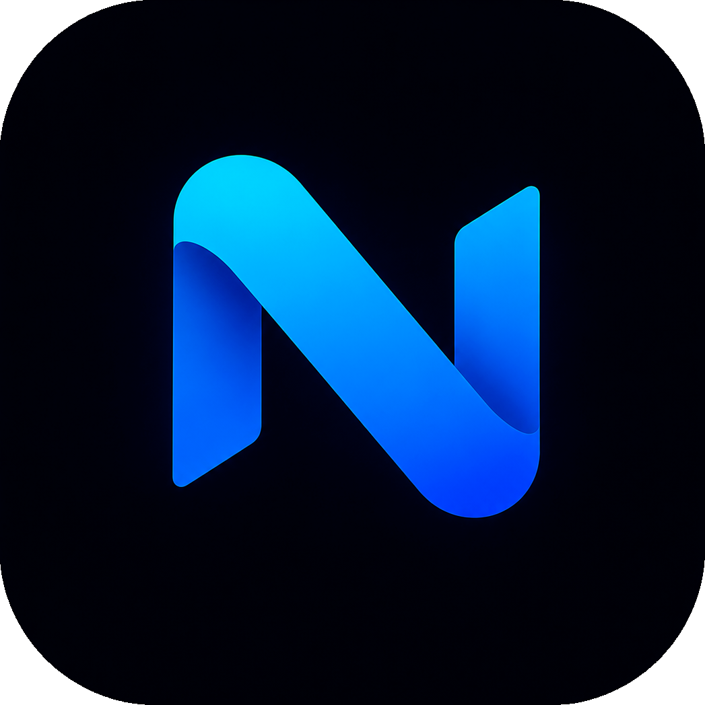

<div align="center">
  

# NetScope

**Локальная сеть — под контролем.**

Десктопное приложение для обнаружения устройств, просмотра топологии и анализа событий локальной сети.

  <p>
    
    
    
    
    
  </p>
</div>

## О проекте

NetScope — русскоязычный инструмент для инвентаризации локальной сети. Он объединяет быстрый TCP-сканер, сведения о сетевых интерфейсах, ARP/MAC, reverse DNS и интерактивное представление топологии в одном тёмном desktop-интерфейсе.

Приложение работает локально: данны�� хранятся в SQLite, а сканирование выполняется через нативный Rust-бэкенд Tauri. Внешние API и фиктивные устройства не используются.

## Возможности

| Раздел           | Что доступно                                                                                                     |
| ---------------- | ---------------------------------------------------------------------------------------------------------------- |
| **Сканирование** | Проверка подсети в формате CIDR, настройка таймаута и числа параллельных проверок, отмена активного сканирования |
| **Обнаружение**  | TCP-порты, ARP/MAC, reverse DNS, определение производителя и базовая классификация устройств                     |
| **Устройства**   | Поиск, фильтр по типу, карточка деталей, редактирование имени и комментария, ручное добавление и удаление        |
| **Топология**    | React Flow-карта с перемещением узлов, связями между устройствами и сохранением координат                        |
| **История**      | Журнал событий и сохранение результатов в локальной базе данных                                                  |
| **Интерфейс**    | Русская локализация, тёмная тема, сворачиваемая боковая панель, быстрый поиск `Ctrl + K`                         |

## Стек

- **Frontend:** React 19, TypeScript, Vite, Zustand, React Flow, Lucide Icons.
- **Desktop:** Tauri v2.
- **Backend:** Rust, Tokio, Futures.
- **Хранилище:** SQLite через SQLx; база создаётся автоматически в каталоге данных приложения.
- **Форматирование:** Prettier.

## Быстрый старт

### Требования

- Windows 10/11;
- Node.js 18+ и npm или pnpm;
- Rust toolchain и Cargo;
- системные зависимости Tauri для Windows, включая WebView2.

### Установка и запуск

```powershell
git clone <URL-РЕПОЗИТОРИЯ>
cd NetworkScanner

# Вариант с npm
npm install
npm run tauri dev
```

Если используете pnpm:

```powershell
pnpm install
pnpm tauri dev
```

> `npm run dev` запускает только веб-интерфейс в браузере. Сетевые команды доступны при запуске полноценного Tauri-приложения.

## Команды

| Команда                | Назначение                                       |
| ---------------------- | ------------------------------------------------ |
| `npm run dev`          | Запуск Vite dev-сервера                          |
| `npm run tauri dev`    | Запуск NetScope в режиме разработки              |
| `npm run build`        | Проверка TypeScript и production-сборка frontend |
| `npx tauri build`      | Сборка desktop-приложения и установщика          |
| `npm run format`       | Форматирование проекта                           |
| `npm run format:check` | Проверка форматирования без изменений            |

Готовые артефакты Tauri появляются в `src-tauri/target/release/bundle/`.

## Как пользоваться

1. Запустите `npm run tauri dev`.
2. Откройте раздел **Обзор сети** и выберите доступный интерфейс.
3. Укажите подсеть CIDR, таймаут и количество параллельных проверок.
4. Нажмите **Запустить сканирование**.
5. Изучайте найденные устройства в таблице или на карте топологии.
6. Сохраните расположение узлов и добавьте заметки в карточках устройств.

Сканируйте только сети, которыми вы владеете или на проверку которых у вас есть разрешение.

## Архитектура

```text
src/                  React-интерфейс и состояние приложения
├── components/       Переиспользуемые UI-компоненты
├── api.ts            Tauri-команды и fallback для браузерного режима
├── store.ts          Zustand store
└── types.ts          Общие типы frontend

src-tauri/src/        Нативный Rust-бэкенд
├── commands.rs       Tauri-команды
├── scanner.rs        Асинхронное сканирование
├── database.rs       SQLite-хранилище
├── classification.rs Классификация устройств
└── history.rs        История изменений и событий
```

Локальная база `netscope.sqlite` создаётся автоматически в системном каталоге данных приложения. Она не попадает в Git благодаря `.gitignore`.

## Текущий статус

Проект находится на стадии первого рабочего вертикального среза. Уже доступны обнаружение устройств, карта, локальное хранилище и журнал событий. Следующими расширениями могут стать SNMP/LLDP/CDP, WMI/WinRM/SSH-мониторы, планировщик проверок, уведомления и дополнительные форматы экспорта.

## Отладка

Для просмотра логов Tauri запускайте приложение из терминала. В браузерном режиме интерфейс намеренно показывает пустое состояние и сообщение о необходимости Tauri для сетевых операций — это ожидаемое поведение.

Перед отправкой изменений рекомендуется выполнить:

```powershell
npm run build
npm run format:check
cargo check --manifest-path src-tauri/Cargo.toml
```

## Лицензия

Проект распространяется по лицензии [MIT](./LICENSE). Полный текст лицензии находится в файле [LICENSE](./LICENSE).
